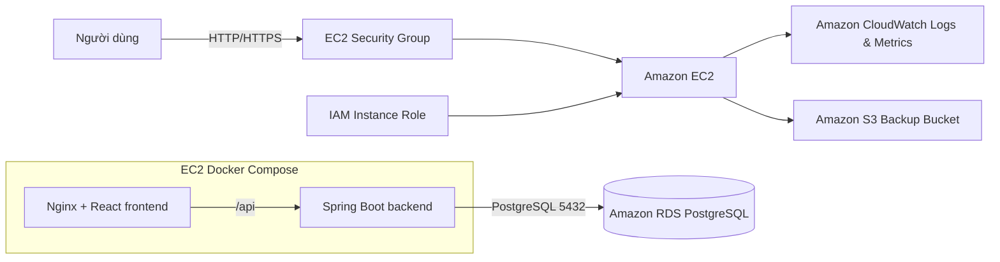

# Kiến trúc AWS đề xuất

## Luồng xử lý

1. Người dùng truy cập public IP, Elastic IP hoặc domain trỏ đến EC2.
2. Nginx phục vụ React SPA và reverse proxy đường dẫn `/api` sang Spring Boot.
3. Backend xác thực JWT, thực thi business logic và truy cập RDS PostgreSQL.
4. CloudWatch Agent gửi log container và metric của EC2 lên CloudWatch.
5. Script backup định kỳ có thể tạo `pg_dump`, nén và tải lên S3 bằng IAM role.

## Security Group

### EC2 Security Group

- Inbound `80` từ Internet cho demo; dùng `443` khi có HTTPS.
- Inbound `22` chỉ từ IP quản trị, hoặc bỏ port 22 và dùng Systems Manager Session Manager.
- Outbound tới RDS port `5432`, CloudWatch và S3.

### RDS Security Group

- Inbound `5432` **chỉ từ EC2 Security Group**.
- Không mở PostgreSQL trực tiếp ra Internet.

## IAM

EC2 instance role nên có quyền tối thiểu:

- Gửi log/metric tới CloudWatch.
- Đọc/ghi đúng S3 backup bucket nếu sử dụng backup.
- Systems Manager permissions nếu quản trị bằng Session Manager.

Không lưu Access Key trong source code hoặc file `.env`.

## Monitoring đề xuất

- Alarm CPU EC2 cao liên tục.
- Alarm disk usage hoặc memory usage từ CloudWatch Agent.
- Alarm HTTP health check thất bại.
- Alarm RDS CPU, free storage, connection count.
- Log retention 7–30 ngày cho môi trường học tập.
